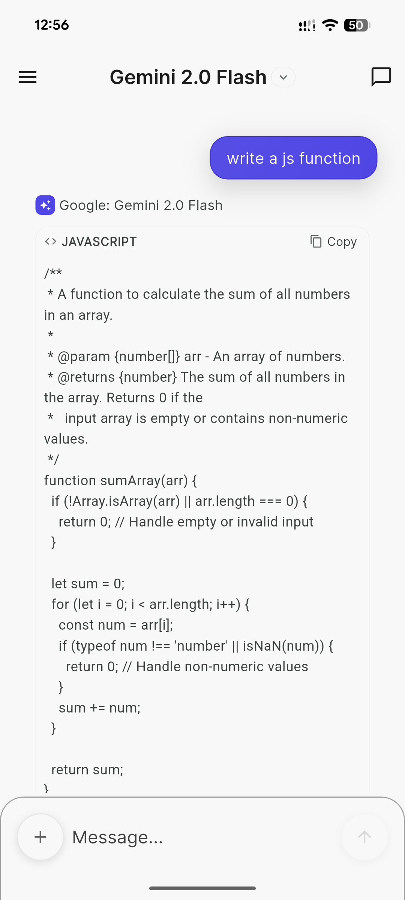
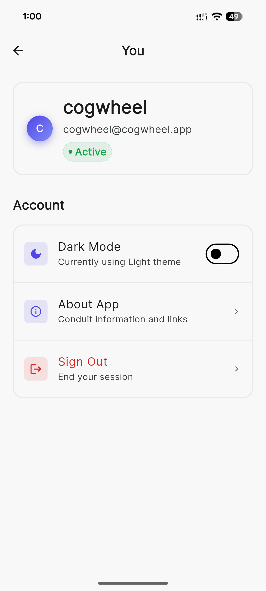

# Conduit - Open-WebUI Mobile Client

<p align="center">
  
  
</p>

Conduit is an open-source, cross-platform mobile application for Open-WebUI, providing a native mobile experience for interacting with your self-hosted AI infrastructure.

## Features

### Core Features
- **Real-time Chat**: Stream responses from AI models in real-time
- **Model Selection**: Choose from available models on your server
- **Conversation Management**: Create, search, and manage chat histories
- **Markdown Rendering**: Full markdown support with syntax highlighting
- **Theme Support**: Light, Dark, and System themes

### Advanced Features
- **Voice Input**: Use speech-to-text for hands-free interaction
- **File Uploads**: Support for images and documents (RAG)
- **Multi-modal Support**: Work with vision models
- **Secure Storage**: Credentials stored securely using platform keychains

## Screenshots

<p align="center">
  
</p>

<p align="center">
  
</p>

<p align="center">
  
</p>

<p align="center">
  
</p>

<p align="center">
  
</p>

## Requirements

- Flutter SDK 3.0.0 or higher
- Android 6.0 (API 23) or higher
- iOS 12.0 or higher
- A running Open-WebUI instance

## Installation

1. Clone the repository:
```bash
git clone https://github.com/yourusername/conduit.git
cd conduit
```

2. Install dependencies:
```bash
flutter pub get
```

3. Generate code:
```bash
flutter pub run build_runner build --delete-conflicting-outputs
```

4. Run the app:
```bash
# For iOS
flutter run -d ios

# For Android
flutter run -d android
```

## Building for Release

### Android
```bash
flutter build apk --release
# or for App Bundle
flutter build appbundle --release
```

### iOS
```bash
flutter build ios --release
```

## Configuration

### Android
The app requires the following permissions:
- Internet access
- Microphone (for voice input)
- Camera (for taking photos)
- Storage (for file selection)

### iOS
The app will request permissions for:
- Microphone access (voice input)
- Speech recognition
- Camera access
- Photo library access

## Architecture

The app follows a clean architecture pattern with:
- **Riverpod** for state management
- **Dio** for HTTP networking
- **WebSocket** for real-time streaming
- **Flutter Secure Storage** for credential management

### Project Structure
```
lib/
├── core/
│   ├── models/         # Data models
│   ├── services/       # API and storage services
│   ├── providers/      # Global state providers
│   └── utils/          # Utility functions
├── features/
│   ├── auth/           # Authentication feature
│   ├── chat/           # Chat interface feature
│   ├── server/         # Server connection feature
│   └── settings/       # Settings feature
└── shared/
    ├── theme/          # App theming
    ├── widgets/        # Shared widgets
    └── utils/          # Shared utilities
```

## Contributing

Contributions are welcome! Please feel free to submit a Pull Request.

1. Fork the project
2. Create your feature branch (`git checkout -b feature/AmazingFeature`)
3. Commit your changes (`git commit -m 'Add some AmazingFeature'`)
4. Push to the branch (`git push origin feature/AmazingFeature`)
5. Open a Pull Request

## License

This project is licensed under the GPL3 License - see the LICENSE file for details.

## Acknowledgments

- Open-WebUI team for creating an amazing self-hosted AI interface
- Flutter team for the excellent mobile framework
- All contributors and users of Conduit

## Support

For issues and feature requests, please use the [GitHub Issues](https://github.com/cogwheel0/conduit/issues) page.